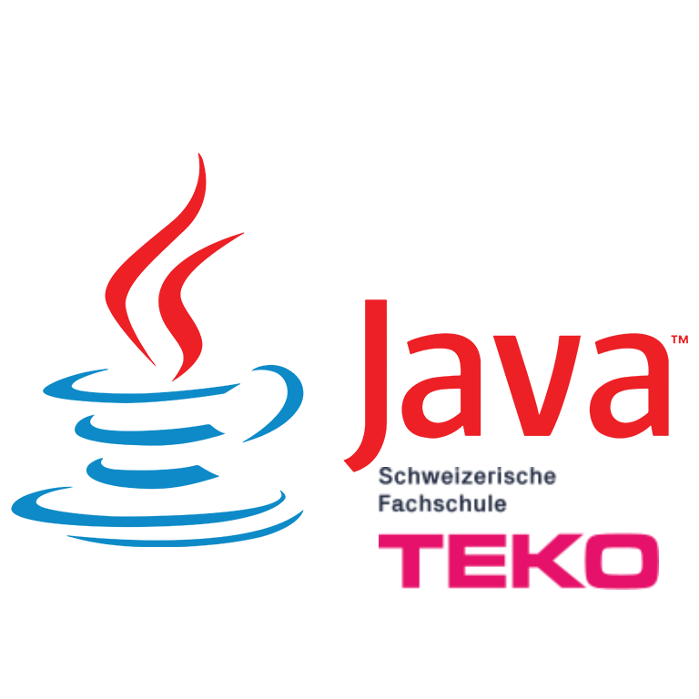

<!-- PROJECT LOGO -->
 

  

  <h3 align="center">Projektarbeit Quicksort in Java</h3>

  

    Die Projektarbeit für das erste Teko Programmiermodul
     

<!-- TABLE OF CONTENTS -->
## Index

* [Über das Projekt](#über-das-projekt)
  * [Programmiersprache](#programmiersprache)
  * [Developers](#developers)
* [Roadmap](#roadmap)

<!-- ABOUT THE PROJECT -->
## Über das Projekt

[![Projekt Screenshots][product-screenshot]](https://example.com)

### Programmiersprache

* Java

### Developers

* Andreas Niederberger
* Riccardo Meyer
* Aljoscha Tröster

<!-- ROADMAP -->
## Roadmap

Hier entsteht eine Roadmap des Projektes
